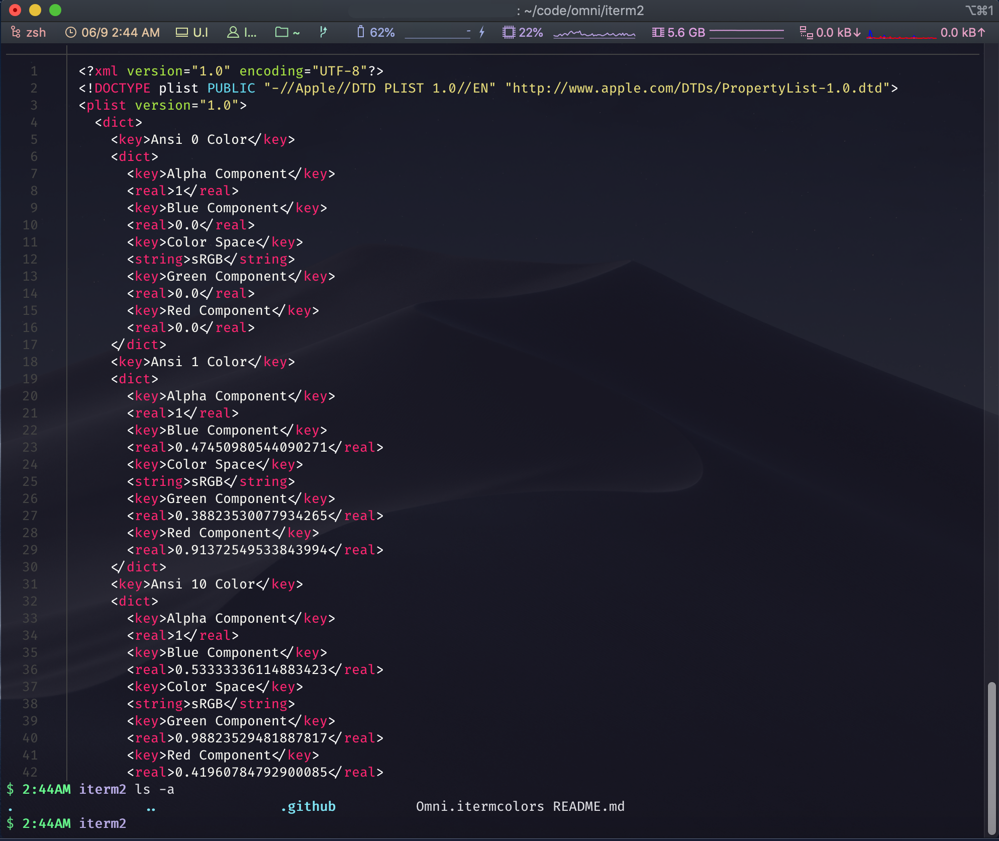

# Omni for [iTerm 2](http://iterm2.com)

> 🎨 Omni is everywhere [iTerm 2](http://iterm2.com)



## Installation Instructions

#### Install using Git

1. Clone the repo locally:

```bash
$ git clone https://github.com/librity/omni-iterm2
```

2. Open iTerm2 and navigate to **Preferences > Profiles > Colors**
3. Click on the **Color Presets...** drop-down an then on **Import...**
4. In the Finder window, navigate to the repo and select `Omni.itermcolors`
5. Click on **Color Presets...** again and select **Omni**
